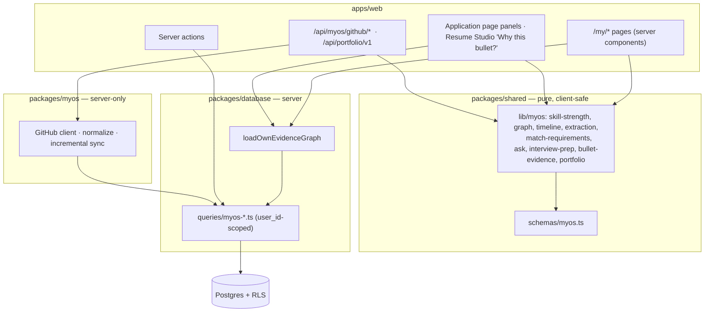
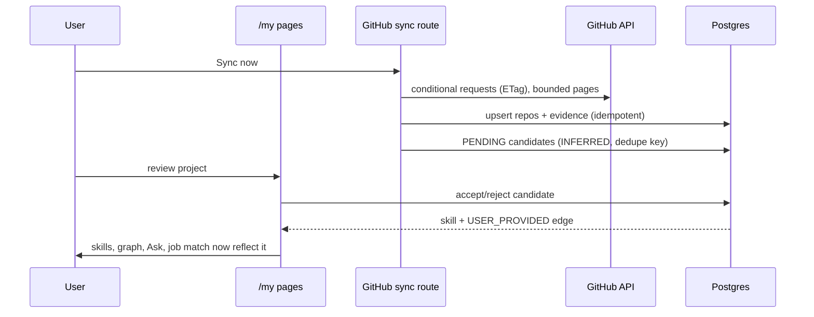

# myOS Architecture

## Layering

Key properties:

- **One load, pure functions.** `loadOwnEvidenceGraph` returns an `EvidenceGraphData` value; every
  algorithm (strength, graph, timeline, matching, Ask, interview prep, portfolio) is a pure,
  deterministic function of it plus `now`. No algorithm touches the database or an LLM.
- **Deterministic by design.** There is no LLM in myOS v1. Extraction, matching and Ask My use
  templates over stored fields, so a claim cannot exist without a stored entity behind it
  (`makeClaim` throws without support). This also means myOS consumes **no AI quota**.
- **Server/client boundary.** `@career-os/database` and `@career-os/myos` are server-only (token
  crypto). Client components receive serializable props and may import only pure `@career-os/shared`.
- **Multi-tenancy.** Every table has `user_id` + the four standard RLS policies, composite
  `(user_id, id)` keys for cross-user-safe references, and every query filters `user_id` explicitly
  (service-role safe). `github_credentials` has RLS enabled with no policies (service-role only).
- **Integrity of the polymorphic edge table.** Trigger validates endpoints exist for the same user;
  delete triggers on every node table clean up edges.
- **Trust boundary for provenance.** `VERIFIED` and `GITHUB_*` evidence are written only by the
  service-role ingestion path (enforced by triggers), so a user cannot self-forge verification via
  the REST API.

## Request flows

## Module map

| Concern | Location |
| --- | --- |
| Migration | `supabase/migrations/0060_myos_evidence_graph.sql` |
| Types / Zod | `packages/shared/src/schemas/myos.ts`, `lib/myos/graph-types.ts` |
| Queries | `packages/database/src/queries/myos-*.ts` |
| Pure logic | `packages/shared/src/lib/myos/*` |
| GitHub | `packages/myos/src/github/*`, `apps/web/app/api/myos/github/*` |
| Pages | `apps/web/app/(app)/my/**` |
| Career OS integration | `apps/web/app/(app)/applications/[id]/myos-*`, `resumes/[id]/studio/myos-*`, `apps/web/lib/myos/*` |
| Portfolio | `apps/web/app/api/portfolio/v1`, `lib/myos/portfolio.ts` |

## Deliberately deferred

- LLM synthesis (summaries, STAR drafting) — would need the shared AI quota seam, an
  `ai_usage_events.task_type` widening, and the `unsupportedClaims` pipeline.
- GitHub OAuth app flow (a fine-grained PAT is supported today).
- Webhook-driven sync, commit-level evidence, tailoring-session bullet grounding.
