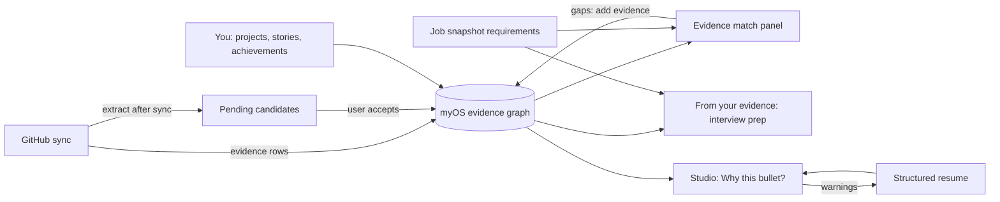

# myOS and Career OS integration

How the myOS evidence graph feeds the existing Career OS application and resume flows. All of
it is deterministic, read-only against myOS tables, and uses no LLM and no AI quota.

## Flows

1. **Evidence in.** GitHub sync stores `GITHUB_REPO` / `GITHUB_README` / `GITHUB_PR` evidence.
   At the end of `POST /api/myos/github/sync`, `generateCandidatesForSelectedRepos`
   (`apps/web/lib/myos/extract-after-sync.ts`) runs the deterministic extractor for every
   repository that is selected and mapped to a project, then writes PENDING candidates through
   `createOwnCandidatesIdempotent`. The dedupe key is checked against every status, so accepted
   and rejected suggestions never come back. A failure here is logged with a generic warning and
   never fails the sync.
2. **Match.** The application page shows an Evidence match panel. Requirements come from the
   current requirement-analysis run if one exists, else the job snapshot's required/preferred
   lists, else rules-based extraction from the posting text. `matchRequirementsToEvidence`
   rates each requirement STRONG / MODERATE / LIMITED / NONE and lists the supporting projects,
   experiences, and evidence with provenance badges. It does not replace the AI requirement
   analysis panel.
3. **Resume.** In Resume Studio, each bullet gets a collapsible "Why this bullet?" with the
   supporting evidence and warning chips when a number or technology is not backed. The check
   is computed on the server when the page loads and compared with the live text; an edited
   bullet is marked stale until saved and reloaded. It is advisory and does not replace the
   numeric and technology guards in the tailoring pipeline.
4. **Interview.** "From your evidence" on the application page builds competency areas,
   STAR stories, relevant projects, your own stored talking points, gaps, and templated
   questions. It sits beside, and is separate from, the AI interview-prep panel.

## Honesty rules

- Nothing is invented. Every name, story, talking point, and evidence row shown is a stored
  row; questions are fixed templates addressed to you.
- A gap is shown as a gap ("No meaningful evidence found"), never smoothed over.
- The verdict does not oversell. WEAK_FIT says so plainly, and also says it reflects what is
  recorded in myOS, not your actual ability.
- Unapproved projects and stories are labeled "unconfirmed" / "not approved yet". They never
  lift a requirement above LIMITED, and unapproved stories do not close a competency gap.
- Text-only matches and INFERRED / AI_GENERATED links are shown as weaker, with provenance badges.
- Warnings are never silently passed: unbacked numbers and technologies are visible chips.
- No panel here calls Claude, consumes `ai_request_limit`, or sends data off the server.

## Multi-tenancy and secrets

All queries are filtered by the verified session `user_id`. Client components receive only
serializable, already-computed data and never import `@career-os/database`. No secrets are
involved.
