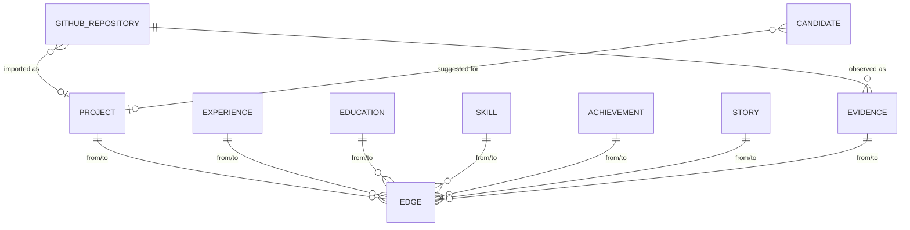

# myOS Evidence Model

myOS answers: *what have I done, what skills have I demonstrated, what evidence supports those
claims, and how should it be used?* Its moat is **structured personal evidence**, not an LLM.

## Design: relational graph on Postgres

No graph database. Nodes are ordinary tables; relationships live in one typed edge table. This keeps
RLS, backups and migrations uniform with the rest of Career OS, and graph queries are done in pure
TypeScript over a single `EvidenceGraphData` bundle (`loadOwnEvidenceGraph`).

| Node | Table | Notes |
| --- | --- | --- |
| Project | `projects` (existing, extended) | `status`, `summary`, `collaborators`, `talking_points`, `origin`, `visibility` added |
| Experience | `experiences` (existing) | `visibility` added |
| Education | `education` (existing) | |
| Skill / Technology | `skills` (existing) | technologies are skills with `category` |
| Achievement / Award / Metric | `myos_achievements` | `kind` distinguishes; `metric_text` is verbatim user text |
| Story (STAR) | `myos_stories` | competencies + themes |
| Evidence / Artifact | `myos_evidence` | provenance carrier; unique on `(user, source_type, source_ref)` |

Edge relations: `DEMONSTRATES`, `USES`, `BELONGS_TO`, `SUPPORTS`, `REPRESENTS`, `REFERENCES`.
Examples: `PROJECT —USES→ SKILL`, `ACHIEVEMENT —BELONGS_TO→ PROJECT`, `EVIDENCE —SUPPORTS→ ACHIEVEMENT`,
`EVIDENCE(repo) —REPRESENTS→ PROJECT`, `STORY —REFERENCES→ PROJECT`.

Integrity: edges are polymorphic (no FK), so a `BEFORE INSERT/UPDATE` trigger verifies both
endpoints exist and belong to the same user (under RLS a foreign id is indistinguishable from a
missing one), and `AFTER DELETE` triggers on every node table remove dangling edges.

## Provenance (non-negotiable)

Every evidence row and every edge carries a `verification_state`:

| State | Meaning |
| --- | --- |
| `VERIFIED` | Directly observed from a source system (e.g. a GitHub API response) |
| `USER_PROVIDED` | The user typed/confirmed it |
| `INFERRED` | Deterministically derived from observed data; **not yet confirmed** |
| `AI_GENERATED` | Produced by a model; never silently promoted |

Rules enforced in code and tests:

1. Extraction output lands in `myos_candidates` (status `PENDING`). Only an explicit user accept
   turns it into a skill/edge/talking point, and the resulting edge is `USER_PROVIDED`.
2. A re-sync never downgrades `VERIFIED`.
3. A metric (`metric_text`) is never `VERIFIED` without a supporting evidence edge.
4. Matching, Ask My, interview prep and resume bullets cite evidence ids; entities that are
   unapproved or only inferred are flagged `unconfirmed` and capped at `LIMITED`.
5. If evidence is absent the output is "no meaningful evidence found" — never a plausible guess.

## Skill strength — transparent semantics

No percentages. `computeSkillStrength` returns a level plus the reasons; see
`SKILL_STRENGTH_RULES` in `packages/shared/src/lib/myos/skill-strength.ts` (rendered in the UI):

- `NONE` no supporting entities · `LIMITED` one entity, or only unverified/inferred support ·
  `MODERATE` ≥2 distinct entities · `STRONG` ≥3 entities, ≥1 verified evidence, activity ≤36 months.
- Recency (`CURRENT`/`RECENT`/`DATED`) and evidence quality are reported separately.

## Visibility

`PRIVATE` (default) < `CAREER_OS_ONLY` < `PUBLIC`. Nothing is public by omission. The portfolio
export (see `PORTFOLIO_API.md`) additionally requires `user_approved` and an explicit
`portfolio_settings.enabled`.

## Relationship to existing grounding

`user_approved && approved_for_applications` remains the gate for **application autofill / resume
generation** (`listOwnApprovedFactsForGeneration`). myOS is a superset layer: it may *show* unapproved
imported projects to their owner (flagged), but nothing unapproved feeds applications.
